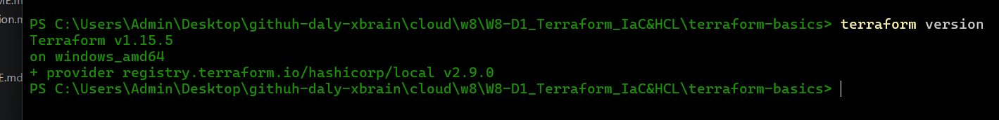
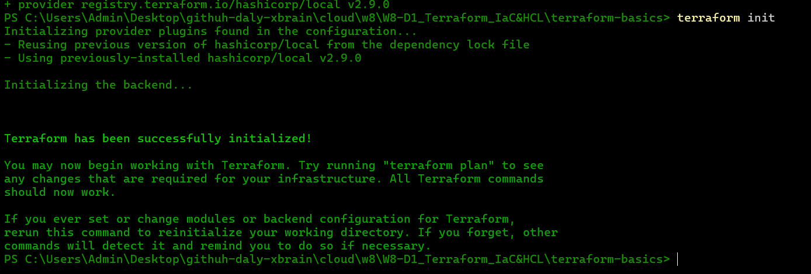
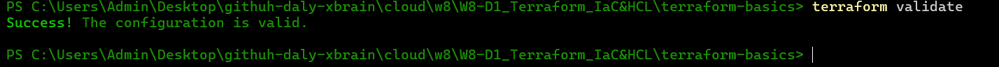
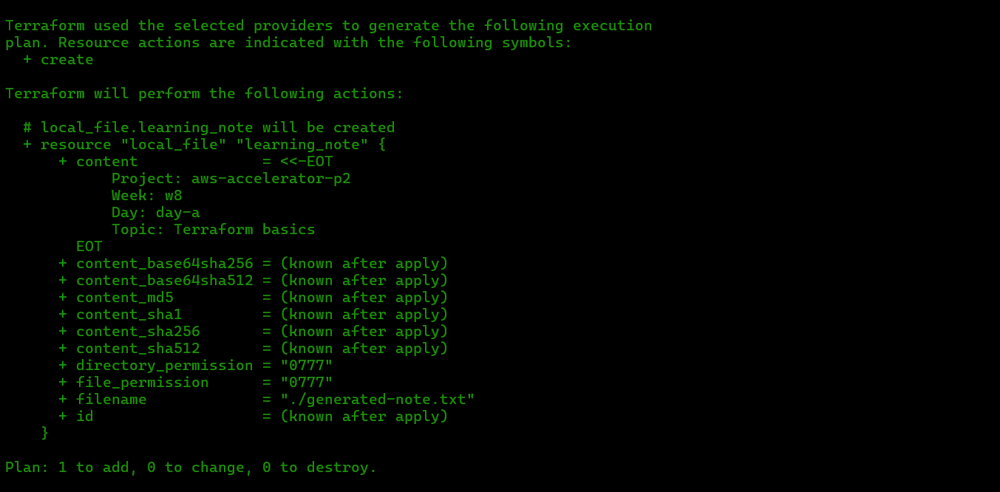

# Minh chứng Ngày 1 (Day 1 Evidence)

## Phiên bản Công cụ (Tool Versions)

Dán kết quả (output) vào đây:

```text
terraform version
```


## Terraform Init

Dán kết quả vào đây:

```text
terraform init
```

## Terraform Validate

Dán kết quả vào đây:

```text
terraform validate
```

## Terraform plan


```text
terraform plan
```

## Tóm tắt nội dung học tập (Learning Summary)

- Cấu hình Terraform có tính khai báo (declarative).
- Cần xem xét kỹ `terraform plan` trước khi chạy lệnh apply.
- File state cần được bảo vệ cẩn thận vì nó ánh xạ (map) cấu hình với hạ tầng thực tế.
