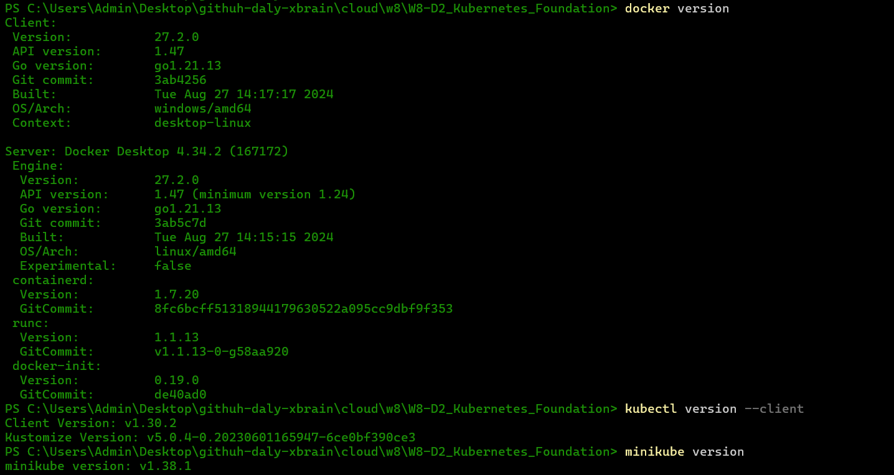
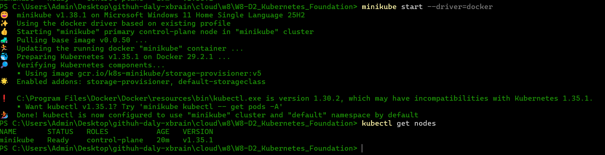
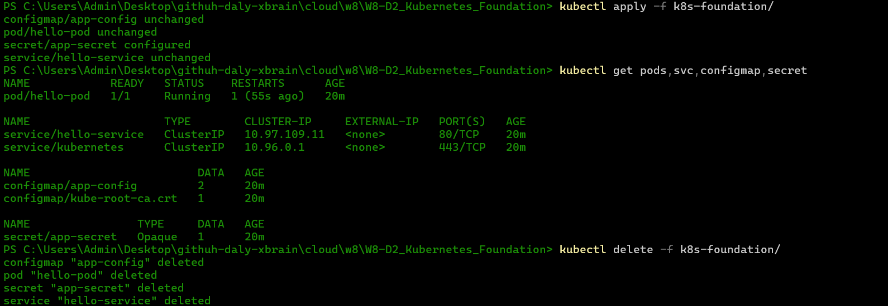

# Minh chứng Ngày 2 (Day 2 Evidence)

## Phiên bản Công cụ (Tool Versions)

Dán kết quả (output) vào đây: 

```text
docker version
kubectl version --client
minikube version
```

## Kiểm tra Cluster (Cluster Check)

Dán kết quả vào đây:

```text
minikube start
kubectl get nodes
```

## Chạy thử Manifest (Manifest Test)

Dán kết quả vào đây:

```text
kubectl apply -f k8s-foundation/
kubectl get pods,svc,configmap,secret
kubectl delete -f k8s-foundation/
```
