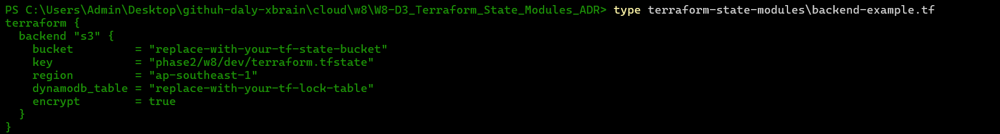
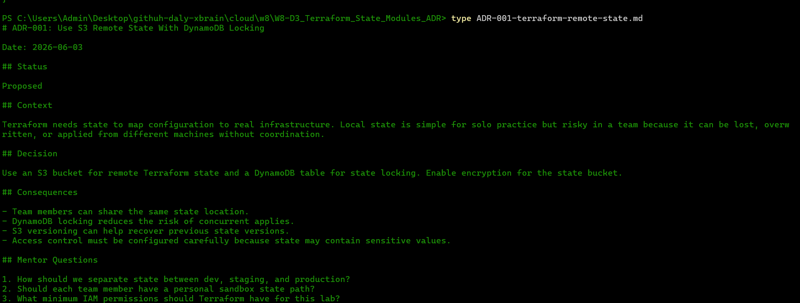

# Day C Evidence

## State Management

Short explanation:

- Local state is acceptable for practice but risky for shared projects.
- Remote state centralizes state and supports collaboration.
- Locking prevents two people from applying changes at the same time.

## Backend Draft

See `terraform-state-modules/backend-example.tf`.

## ADR

See `ADR-001-terraform-remote-state.md`.

## Questions For Mentor

1. How should we name state keys across weeks and environments?
2. Should the remote state bucket be created manually or by a bootstrap Terraform project?
3. What logs/screenshots are expected as evidence for W8?

