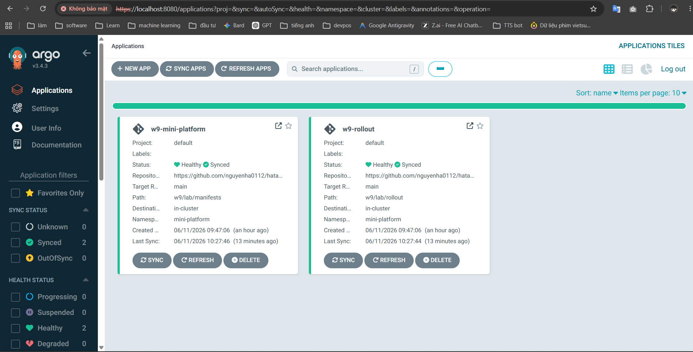
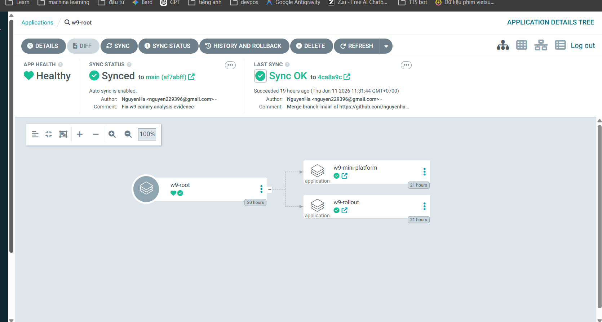
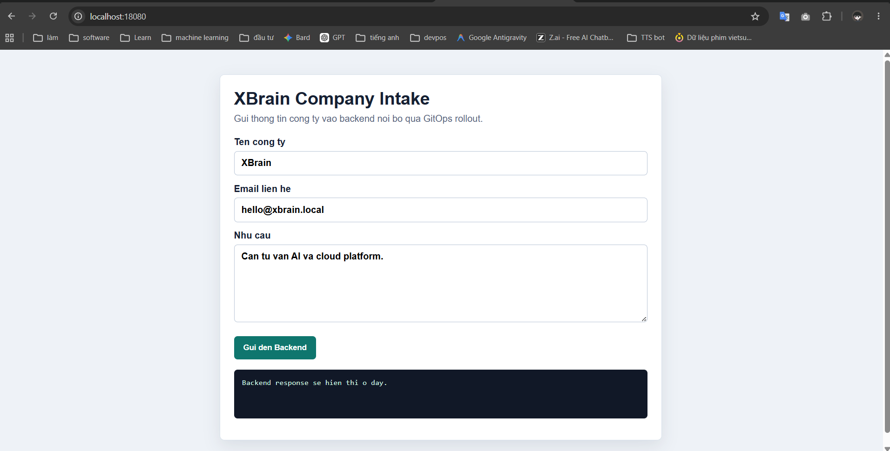
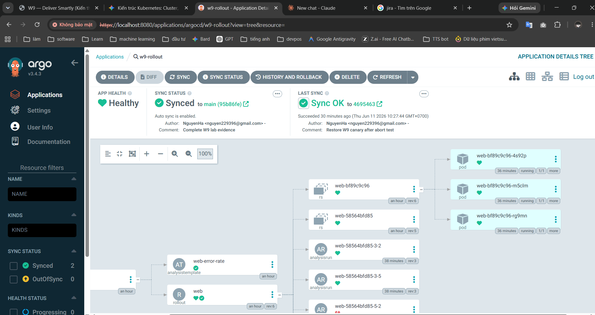

# W9 Lab Evidence

## 1. GitOps

Đã tạo và đồng bộ ArgoCD theo mô hình app-of-apps:

- Root app: `w9-root`
- Platform app: `w9-mini-platform`
- Rollout app: `w9-rollout`

Lệnh đã chạy:

```powershell
kubectl get applications -n argocd
```

Kết quả:

```text
NAME               SYNC STATUS   HEALTH STATUS
w9-mini-platform   Synced        Healthy
w9-rollout         Synced        Healthy
w9-root            Synced        Healthy
```

Ảnh ArgoCD Applications:



Ảnh root app quản lý các app con:



## 2. Platform App

Đã deploy namespace, frontend, backend và service trong namespace `mini-platform`.

Lệnh đã chạy:

```powershell
kubectl apply -f cloud\w9\lab\manifests
kubectl get pods -n mini-platform -o wide
kubectl get svc,endpoints -n mini-platform
```

Kết quả:

```text
web-5675fd79c9-2v9pd         1/1 Running
web-5675fd79c9-lqlzx         1/1 Running
xbrain-api-d69bbcb4b-2lw8p   1/1 Running

service/web          80/TCP
service/xbrain-api   8080/TCP
endpoints/web        10.244.0.91:80,10.244.0.90:80
endpoints/xbrain-api 10.244.0.82:8080
```

Kiểm tra frontend:

```powershell
kubectl port-forward svc/web -n mini-platform 18080:80
curl.exe -s http://localhost:18080
```

Kết quả có:

```text
<title>XBrain Company Form</title>
<h1>XBrain Company Intake</h1>
```

Ảnh web frontend:



Kiểm tra backend qua Nginx proxy:

```powershell
curl.exe --% -s -X POST http://localhost:18080/api/xbrain-company -H "content-type: application/json" -d "{""company"":""XBrain"",""email"":""hello@xbrain.local"",""message"":""GitOps evidence test""}"
```

Kết quả có response từ backend pod:

```text
"hostname": "xbrain-api-d69bbcb4b-2lw8p"
"company": "XBrain"
"email": "hello@xbrain.local"
```

## 3. Observability

Đã deploy OpenTelemetry Collector, PrometheusRule và fake Prometheus local.

Lệnh đã chạy:

```powershell
kubectl apply -f cloud\w9\W9-D2_Observability_SLO_OTel\otel\collector.yaml
kubectl apply -f cloud\w9\W9-D2_Observability_SLO_OTel\alert-rules\slo-burn-rate.yaml
kubectl get pods -n observability
kubectl get prometheusrule -n observability
```

Kết quả:

```text
fake-prometheus-fd7468447-wbfs6   1/1 Running
otel-collector-5fb9587786-kz5dc   1/1 Running

NAME                AGE
web-slo-burn-rate   20h
```

Fake Prometheus đang trả metric tốt:

```powershell
kubectl get configmap fake-prometheus-content -n observability -o yaml
```

Kết quả:

```text
value [0,"0"]
```

## 4. Canary Rollout

Đã deploy Argo Rollouts resource trong `cloud/w9/lab/rollout`.

Lệnh đã chạy:

```powershell
kubectl apply -f cloud\w9\lab\rollout
kubectl get rollout web -n mini-platform
kubectl get analysisrun -n mini-platform --sort-by=.metadata.creationTimestamp
```

Kết quả rollout:

```text
NAME   DESIRED   CURRENT   UP-TO-DATE   AVAILABLE
web    2         2         2            2
```

AnalysisRun mới thành công:

```text
web-5675fd79c9-15-2   Successful
web-5675fd79c9-15-5   Successful
```

Điều kiện analysis đang dùng:

```powershell
kubectl get analysistemplate web-error-rate -n mini-platform -o jsonpath="{.spec.metrics[0].successCondition}"
```

Kết quả:

```text
result[0] <= 0.01
```

Ảnh rollout trong ArgoCD:



## 5. Bad Canary Abort

Đã có evidence canary fail và rollback về stable.

Lệnh đã chạy:

```powershell
kubectl get analysisrun -n mini-platform --sort-by=.metadata.creationTimestamp
kubectl describe rollout web -n mini-platform
```

Kết quả fail:

```text
web-5675fd79c9-13-2   Failed
```

Trong rollout event có:

```text
Rollout aborted update to revision 13
Metric "error-rate" assessed Failed
Rollback to stable ReplicaSets
```

Trạng thái cuối sau rollback và sync lại Git:

```text
Rollout web: Healthy
ArgoCD apps: Synced / Healthy
AnalysisRun revision 15: Successful
```

## 6. Link Evidence Để Chụp

- Web app: `http://localhost:18080`
- ArgoCD UI: `https://localhost:8080`
- ArgoCD user: `admin`
- ArgoCD password: `DdgYNc3Bm7921R97`
